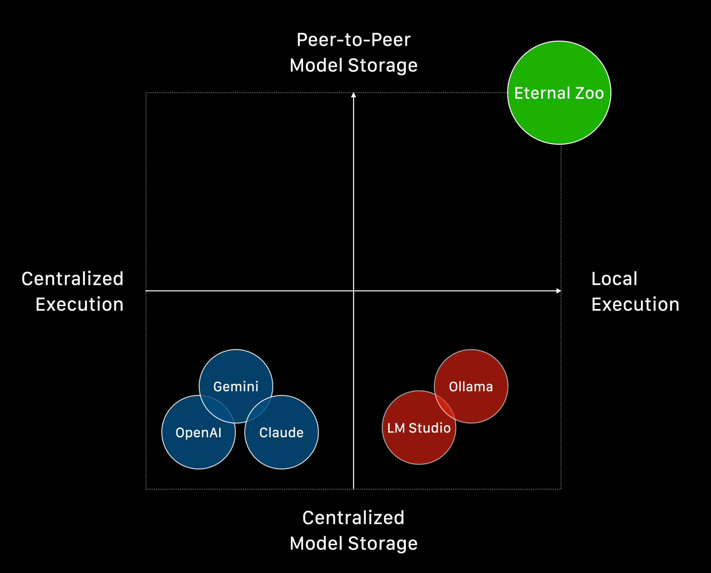

# 🚀 Eternal Zoo: Sovereign Weights


## The Easiest Way to Run Your Own AI Models with Complete Sovereignty


This guide will help you deploy your AI models using peer-to-peer infrastructure. Whether you're a developer or AI enthusiast, you'll learn how to run your models with complete sovereignty - maintaining full control over your AI weights through peer-to-peer storage.

## 📑 Table of Contents
- [Key Features](#-key-features)
- [Before You Start](#-before-you-start)
- [Getting Started](#️-getting-started)
- [CLI Overview](#-cli-overview)
- [Running Models](#-running-models)
- [Using the API](#-using-the-api)
- [Multi-Model Support](#-multi-model-support)
- [Advanced Usage](#advanced-usage)
- [Additional Information](#-additional-information)
- [Migration Guide](#-migration-guide)
- [Need Help?](#-need-help)

## 🌟 Key Features

### 🚀 What Makes Eternal Zoo Different from Ollama & LMStudio

**🌐 TRUE Peer-to-Peer Model Storage**
- Unlike Ollama/LMStudio that rely on centralized repositories (Hugging Face, GitHub), Eternal Zoo uses **IPFS/Filecoin** for permanent, censorship-resistant model distribution
- Models are stored across a distributed network - **no single point of failure or control**
- Access your models even if traditional platforms go down or restrict access

**🔒 Ultimate Privacy with Local Execution**  
- **100% local inference** - your data never touches external servers (unlike cloud AI services)
- **Zero telemetry** - no usage tracking, no model access logs, no data collection
- **Air-gapped capability** - run models completely offline once downloaded

### 🛠️ Additional Capabilities

- **🏛️ Sovereign Weights**: Maintain complete ownership and control over your AI models
- **🛡️ Zero Trust Privacy**: Your prompts, responses, and model usage remain completely private
- **🔗 OpenAI Compatibility**: Use familiar API endpoints with your existing tools
- **👁️ Multi-Model Support**: Works with both text and vision models
- **🚀 Model Access**: Run any GGUF model directly from Hugging Face
- **⚡ Parallel Processing**: Efficient model compression and upload
- **🔄 Automatic Retries**: Robust error handling for network issues
- **📊 Metadata Management**: Comprehensive model information tracking

### Why Sovereign Weights Matter

In an era of increasing AI centralization, Eternal Zoo puts you back in control:

- **Own Your Models**: Models are stored on peer-to-peer infrastructure, not controlled by any single entity
- **Private by Design**: All inference happens locally on your hardware - no external API calls, no data collection
- **Censorship Resistant**: peer-to-peer storage ensures your models remain accessible regardless of platform policies
- **Vendor Independence**: Break free from proprietary AI services and their limitations

##  Before You Start

### System Requirements
- macOS or Linux operating system
- Sufficient RAM for your chosen model (see model specifications below)
- Stable internet connection for model uploads


## 🛠️ Getting Started

### Installation

#### For macOS (Using Setup Script):
```bash
make install-macos
```

#### For Ubuntu (Using Setup Script):
```bash
bash ubuntu.sh
```

#### For Jetson (Using Setup Script):
```bash
bash jetson.sh
```

### Setting Up Your Environment

1. Activate the virtual environment:
```bash
source activate.sh
```
> **Remember**: Activate this environment each time you use the Eternal Zoo (`eai`) tools

2. Verify your installation:
```bash
eai --version
```

## 📖 CLI Overview

Eternal Zoo uses a structured command hierarchy for better organization. All model operations are grouped under the `model` subcommand:

```bash
# Model operations
eai model run --hash <hash>           # Run a model server
eai model run <model-name>            # Run a preserved model (e.g., qwen3-1.7b)
eai model run --hf-repo <repo> --hf-file <file> --task <task>  # Run any GGUF model from Hugging Face
eai model run --config <config.yaml>  # Run multiple models using config file
eai model serve [--main-hash <hash>]  # Serve all downloaded models (with optional main model)
eai model stop                        # Stop the running model server  
eai model status                      # Check which model is running
eai model download --hash <hash>      # Download a model from IPFS
eai model preserve --folder-path <path>  # Upload/preserve a model to IPFS

# General commands
eai --version                         # Show version information
```

### Command Examples

```bash
# Run a preserved model (user-friendly)
eai model run qwen3-1.7b

# Run any model by hash
eai model run --hash bafkreiacd5mwy4a5wkdmvxsk42nsupes5uf4q3dm52k36mvbhgdrez422y

# Run any GGUF model directly from Hugging Face
eai model run --hf-repo dphn/Dolphin3.0-Llama3.1-8B-GGUF --hf-file Dolphin3.0-Llama3.1-8B-Q4_0.gguf --task chat

# Run multiple models using config file
eai model run --config config.yaml

# Serve all downloaded models with specific main model
eai model serve --main-hash bafkreiacd5mwy4a5wkdmvxsk42nsupes5uf4q3dm52k36mvbhgdrez422y

# Check status
eai model status

# Stop the running model
eai model stop

# Download a model locally
eai model download --hash bafkreiacd5mwy4a5wkdmvxsk42nsupes5uf4q3dm52k36mvbhgdrez422y

# Upload your own model
eai model preserve --folder-path ./my-model-folder --task chat --ram 8.5
```

## 🚀 Running Models

### 🆕 Running Any GGUF Model from Hugging Face

Eternal Zoo now supports running any GGUF model directly from Hugging Face without needing to download or preserve it first. This gives you instant access to thousands of models available on Hugging Face.

#### **Basic Usage**
```bash
# Run any GGUF model from Hugging Face
eai model run --hf-repo <repository> --hf-file <filename> --task <task_type>

# Example: Run Dolphin-3.0 model
eai model run --hf-repo dphn/Dolphin3.0-Llama3.1-8B-GGUF --hf-file Dolphin3.0-Llama3.1-8B-Q4_0.gguf --task chat
```

#### **Parameters**
- `--hf-repo`: Hugging Face repository (e.g., `dphn/Dolphin3.0-Llama3.1-8B-GGUF`)
- `--hf-file`: Specific GGUF file name (e.g., `Dolphin3.0-Llama3.1-8B-Q4_0.gguf`)
- `--task`: Task type (`chat` for text generation, `embed` for embeddings)

#### **Finding Models on Hugging Face**
1. Visit [Hugging Face](https://huggingface.co/) and search for GGUF models
2. Navigate to the model repository
3. Find the `.gguf` file you want to use
4. Use the repository name and file name in your command

#### **Example Models You Can Run**
```bash
# Language Model
eai model run --hf-repo bartowski/phi-4-GGUF --hf-file phi-4-Q4_K_M.gguf --task chat

# Large Model with gguf-split files
eai model run --hf-repo unsloth/Qwen3-235B-A22B-Thinking-2507-GGUF --pattern Q4_K_M

# Vision Language Model
eai model run --hf-repo unsloth/Qwen2.5-VL-7B-Instruct-GGUF --hf-file Qwen2.5-VL-7B-Instruct-Q4_K_M.gguf --mmproj mmproj-F16.gguf --task chat

# Embedding Model
eai model run --hf-repo jinaai/jina-embeddings-v4-text-matching-GGUF --hf-file jina-embeddings-v4-text-matching-Q4_K_M.gguf --task embed
```

#### **Benefits**
- **Instant Access**: No need to download or preserve models first
- **Huge Selection**: Access to thousands of models on Hugging Face
- **Latest Models**: Try new models as soon as they're uploaded
- **Flexible**: Works with any GGUF-compatible model

### 🎛️ Multi-Model Configuration with Config Files

Eternal Zoo supports running multiple models simultaneously using YAML configuration files. This allows you to specify which model should be the main model (loaded immediately) and which models should be loaded on-demand.

#### **Config File Structure**

Create a YAML file (e.g., `config.yaml`) with the following structure:

```yaml
port: 8080
host: 0.0.0.0
models:
  # Main model - loaded immediately when server starts
  qwen3-30b:
    model: qwen3-30b-a3b-instruct-2507 # Featured model name from eternal-zoo
    on_demand: False  # Main model - loaded immediately

  flux-dev-nsfw:
    model: flux-dev-nsfw # Featured model name from eternal-zoo
    on_demand: True   # On-demand model - loaded only when requested
  
  # Hugging Face model
  medgemma-27b:
    hf_repo: medgemma/MedGemma-3-27B-GGUF
    model: medgemma-27b-it-Q8_0.gguf
    mmproj: mmproj-F16.gguf
    task: chat
    on_demand: True   # On-demand model - loaded when requested
  
  # Embedding model
  jina-embeddings-v4:
    hf_repo: jinaai/jina-embeddings-v4-text-code-GGUF
    model: jina-embeddings-v4-text-code-F16.gguf
    task: embed
    on_demand: True   # On-demand model - loaded when requested
```

#### **Model Configuration Options**

| Option | Description | Default |
|--------|-------------|---------|
| `model` | Featured model name from eternal-zoo or model name from Hugging Face | - |
| `hf_repo` | Hugging Face repository | - |
| `task` | Model task type (`chat`, `embed`, `image-generation`) | `chat` |
| `mmproj` | Multimodal projector file (for vision models) | - |
| `architecture` | Model architecture (for image-generation models) | - |
| `lora` | LoRA model (for LoRA models) | - |
| `base_model` | Base model name (for LoRA models) | - |
| `on_demand` | `False` for main model, `True` for on-demand models | `True` |

#### **Running with Config Files**

```bash
# Run multiple models using config file
eai model run --config config.yaml
```

#### **Main Model Selection**

- **Primary Rule**: The first model with `on_demand: False` becomes the main model
- **Fallback**: If no model has `on_demand: False`, the first model in the config becomes the main model
- **Behavior**: The main model is loaded immediately when the server starts, while on-demand models are loaded only when first requested

#### **Example Configurations**

**Simple Multi-Model Setup:**
```yaml
port: 8080
host: 0.0.0.0
models:
  qwen3-8b:
    model: qwen3-8b
    on_demand: False  # Main model
  
  gemma-3-4b:
    model: gemma-3-4b
    on_demand: True   # On-demand model
```

**Mixed Model Sources:**
```yaml
port: 8080
host: 0.0.0.0
models:
  # Featured model as main
  qwen3-30b:
    model: qwen3-30b-a3b-instruct-2507
    on_demand: False
  
  # IPFS model on-demand
  flux-dev:
    hash: bafkreiaha3sjfmv4affmi5kbu6bnayenf2avwafp3cthhar3latmfi632u
    on_demand: True
  
  # Hugging Face model on-demand
  dolphin-3.0:
    hf_repo: dphn/Dolphin3.0-Llama3.1-8B-GGUF
    model: Dolphin3.0-Llama3.1-8B-Q4_0.gguf
    task: chat
    on_demand: True
```

**Vision Model Setup:**
```yaml
port: 8080
host: 0.0.0.0
models:
  # Main vision model
  gemma-3-4b:
    model: gemma-3-4b
    on_demand: False
  
  # On-demand vision model from Hugging Face
  qwen2.5-vl:
    hf_repo: unsloth/Qwen2.5-VL-7B-Instruct-GGUF
    model: Qwen2.5-VL-7B-Instruct-Q4_K_M.gguf
    mmproj: mmproj-F16.gguf
    task: chat
    on_demand: True
```

#### **Benefits of Config Files**

- **🎯 Precise Control**: Specify exactly which model should be main vs on-demand
- **📦 Easy Deployment**: Store your model configuration in version control
- **🔄 Reproducible**: Share config files for consistent setups across environments
- **⚡ Performance**: Optimize loading times by choosing the right main model
- **🛠️ Flexible**: Mix different model sources (featured, IPFS, Hugging Face)

### Available Pre-uploaded Models

We've prepared several models for you to test with. Each model is listed with its specifications and command to run.

#### 🔤 Qwen3 Series
[Learn more about Qwen3](https://qwenlm.github.io/blog/qwen3/)

| Model | Size | RAM | Command |
|-------|------|-----|---------|
| qwen3-embedding-0.6b | 649 MB | 1.16 GB | `eai model run qwen3-embedding-0.6b` |
| qwen3-embedding-4b | 4.28 GB | 5.13 GB | `eai model run qwen3-embedding-4b` |
| qwen3-1.7b | 1.83 GB | 5.71 GB | `eai model run qwen3-1.7b` |
| qwen3-4b | 4.28 GB | 9.5 GB | `eai model run qwen3-4b` |
| qwen3-8b | 6.21 GB | 12 GB | `eai model run qwen3-8b` |
| qwen3-14b | 15.7 GB | 19.5 GB | `eai model run qwen3-14b` |
| qwen3-30b-a3b | 31 GB | 37.35 GB | `eai model run qwen3-30b-a3b` |
| qwen3-32b | 34.8 GB | 45.3 GB | `eai model run qwen3-32b` |
| qwen3-235b-a22b | 132 GB | 155.61 GB | `eai model run qwen3-235b-a22b` |
| qwen3-coder-480b-a35b | 260 GB | 305.66 GB | `eai model run qwen3-coder-480b-a35b` |

#### 🔤 Dolphin-3.0 Series
[Learn more about Dolphin-3.0](https://huggingface.co/dphn/Dolphin3.0-Llama3.1-8B)

| Model | Size | RAM | Command |
|-------|------|-----|---------|
| dolphin-3.0-llama3.1-8b | 8.54 GB | 13.29 GB | `eai model run dolphin-3.0-llama3.1-8b` |

#### 👁️ Gemma-3 Series (Vision Support)
[Learn more about Gemma3](https://deepmind.google/models/gemma/gemma-3/)

| Model | Size | RAM | Command |
|-------|------|-----|---------|
| gemma-3-4b | 3.16 GB | 7.9 GB | `eai model run gemma-3-4b` |
| gemma-3-12b | 8.07 GB | 21.46 GB | `eai model run gemma-3-12b` |
| gemma-3-27b | 17.2 GB | 38.0 GB | `eai model run gemma-3-27b` |

#### 🔤 Gemma-3n Series 
[Learn more about Gemma-3n](https://deepmind.google/models/gemma/gemma-3n/)

| Model | Size | RAM | Command |
|-------|------|-----|---------|
| gemma-3n-e4b | 7.35 GB | 10.08 GB | `eai model run gemma-3n-e4b` |

#### 🔤 Devstral-Small
[Learn more about Devstral-Small](https://mistral.ai/news/devstral)

| Model | Size | RAM | Command |
|-------|------|-----|---------|
| devstral-small | 25.1 GB | 31.71 GB | `eai model run devstral-small` |

#### 🔤 LFM2 Series
[Learn more about LFM2](https://www.liquid.ai/)

| Model | Size | RAM | Command |
|-------|------|-----|---------|
| lfm2-1.2b | 1.25 GB | 1.72 GB | `eai model run lfm2-1.2b` |

#### 🔤 OpenReasoning-Nemotron Series
[Learn more about OpenReasoning-Nemotron](https://huggingface.co/nvidia/OpenReasoning-Nemotron-32B)

| Model | Size | RAM | Command |
|-------|------|-----|---------|
| openreasoning-nemotron-32b | 34.8 GB | 45.21 GB | `eai model run openreasoning-nemotron-32b` |

#### 🎨 Flux Series
[Learn more about Flux](https://bfl.ai/models/flux-kontext)

Generate high-quality images from text prompts using Flux models.

| Model | Size | RAM | Command |
|-------|------|-----|---------|
| flux-dev | 32 GB | 20 GB | `eai model run flux-dev` |
| flux-schnell | 32 GB | 20 GB | `eai model run flux-schnell` |
| flux-dev-nsfw | 32 GB | 20.1 GB | `eai model run flux-dev-nsfw` |

**Note**: The `flux-dev-nsfw` model includes LoRA safetensor support for enhanced image generation capabilities.

**Example usage:**
```bash
eai model run flux-dev
```

## 💻 Using the API

The API follows the OpenAI-compatible format, making it easy to integrate with existing applications.

### Prefer a GUI?
If you would rather interact with your models through a user-friendly desktop interface, download the **CryptoAgents** app from our Agent Store: [eternalai.org/agent-store](https://eternalai.org/agent-store).


### Text Chat Example
```bash
curl -X POST http://localhost:8080/v1/chat/completions \
  -H "Content-Type: application/json" \
  -d '{
    "model": "local-model",
    "messages": [
        {"role": "user", "content": "Hello! Can you help me write a Python function?"}
    ],
    "temperature": 0.7,
    "max_tokens": 4096
}'
```

### Vision Chat Example (Gemma models only)
```bash
curl -X POST http://localhost:8080/v1/chat/completions \
  -H "Content-Type: application/json" \
  -d '{
    "model": "local-model",
    "messages": [
       {
        "role": "user",
        "content": [
            {
                "type": "text",
                "text": "What do you see in this image? Please describe it in detail."
            },
            {
                "type": "image_url",
                "image_url": {
                    "url": "https://example.com/your-image.jpg"
                }
            }
        ]
       }
    ],
    "temperature": 0.7,
    "max_tokens": 4096
}'
```

### Embedding Example

```bash
curl -X POST http://localhost:8080/v1/embeddings \
  -H "Content-Type: application/json" \
  -d '{
    "model": "local-model",
    "input": ["Hello, world!"]
}'
```

### Image Generation Example (Flux models)

```bash
curl -X POST http://localhost:8080/v1/images/generations \
  -H "Content-Type: application/json" \
  -d '{
    "model": "local-model",
    "prompt": "A serene landscape with mountains and a lake at sunset",
    "n": 1,
    "size": "1024x1024"
}'
```

## 🔄 Multi-Model Support

Eternal Zoo supports running multiple models simultaneously with intelligent request-based switching. This allows you to serve several models from a single server instance with optimized resource usage.

### How Multi-Model Works

#### **Setup Types:**

1. **Single Model**: Traditional approach - one model loaded and active
2. **Multi-Model**: Multiple models available, with automatic switching based on requests

#### **Model States:**
- **Main Model**: The primary model that's immediately loaded and active when the server starts
- **On-Demand Models**: Additional models that are loaded automatically when first requested

### **Request-Based Model Switching**

When a client makes a request specifying a model (via the `model` field in the API), the system:

1. **Checks Current Model**: If the requested model is already active → processes immediately
2. **Smart Switching**: If a different model is requested → automatically switches to that model
3. **Stream Protection**: Waits for active streams to complete before switching models
4. **Automatic Loading**: On-demand models are loaded seamlessly when first requested

#### **Switching Logic Flow:**
```
Incoming Request
    ↓
Check Model Field
    ↓
Model Field Present?
    ├─ NO → Use Main Model (immediate)
    └─ YES → Validate Model ID
        ├─ Invalid ID/Folder Name → Use Main Model (fallback)
        └─ Valid ID → Check Task Compatibility
            ├─ Task Mismatch → Use First Compatible Model (fallback)
            └─ Task Compatible → Is Requested Model Active?
                ├─ YES → Process Request Immediately
                └─ NO → Check for Active Streams
                    ├─ Streams Active → Wait for Completion
                    └─ No Streams → Switch Model → Process Request
```

**Key Validation Steps:**
- **Model ID Format**: Only valid model IDs (from `/v1/models` `id` field) work for switching
- **Task Compatibility**: Models must support the requested endpoint type (chat/embed/image-generation)
- **Model Availability**: Requested model must exist in the available models list
- **Resource Validation**: Sufficient resources must be available for model switching

**Fallback Behavior:**
- **Silent Fallbacks**: Invalid models, task mismatches, and missing model fields default to main model without errors
- **No Error Messages**: The server gracefully handles invalid requests by using the main model
- **Performance Impact**: Fallback requests use main model (fastest response, no switching delay)
- **Client Responsibility**: Applications should validate models using `/v1/models` before making requests

**Best Practices for Model Switching:**
- **Always Use Model IDs**: Use the `id` field from `/v1/models` as the `model` field in requests
- **Validate Before Requests**: Check `/v1/models` to ensure your requested model exists and supports the task
- **Handle Fallbacks Gracefully**: Implement client-side validation to detect when fallbacks occur
- **Monitor Performance**: Track switching delays and fallback rates in your applications
- **Group Similar Tasks**: Keep models of the same task type together for faster switching
- **Choose Main Model Wisely**: Select your most frequently used model as the main model for optimal performance

### **Running Multi-Model Setups**

#### **Option 1: Using Config Files (Recommended)**
Run multiple models with precise control over main vs on-demand models:
```bash
eai model run --config config.yaml
```

#### **Option 2: Using Downloaded Models**
Serve all downloaded models with a specific main model:
```bash
eai model serve --main-model <main-model-id>
```
or
```bash
eai model serve --main-hash <main-model-hash>
```

### **API Usage with Multi-Model**

Once running, specify which model to use in your API requests:

#### **Discovering Available Models**

First, check what models are available using the `/v1/models` endpoint:

```bash
curl http://localhost:8080/v1/models
```

**Example Response:**
```json
{
  "object": "list",
  "data": [
    {
      "id": "bafkreie4uj3gluik5ob2ib3cm2pt6ww7n4vqpmjnq6pas4gkkor42yuysa",
      "object": "model",
      "created": 1753757438,
      "owned_by": "user",
      "active": true,
      "task": "chat",
      "is_lora": false,
      "multimodal": false,
      "context_length": 32768,
      "lora_config": null
    }
  ]
}
```

#### **Using the Model Field in Requests**

Use the `id` from `/v1/models` as the `model` field in your requests:

##### **Chat Models (task: "chat")**

```bash
# Request using the available chat model
curl -X POST http://localhost:8080/v1/chat/completions \
  -H "Content-Type: application/json" \
  -d '{
    "model": "bafkreie4uj3gluik5ob2ib3cm2pt6ww7n4vqpmjnq6pas4gkkor42yuysa",
    "messages": [{"role": "user", "content": "Hello!"}]
}'
```

##### **Embedding Models (task: "embed")**

```bash
# Use embedding model for text similarity
curl -X POST http://localhost:8080/v1/embeddings \
  -H "Content-Type: application/json" \
  -d '{
    "model": "bafkreiacd5mwy4a5wkdmvxsk42nsupes5uf4q3dm52k36mvbhgdrez422y",
    "input": ["Hello, world!", "How are you?"]
}'
```

##### **Image Generation Models (task: "image-generation")**

```bash
# Generate images using available model
curl -X POST http://localhost:8080/v1/images/generations \
  -H "Content-Type: application/json" \
  -d '{
    "model": "bafkreibks5pmc777snbo7dwk26sympe2o24tpqfedjq6gmgghwwu7iio34",
    "prompt": "A serene landscape with mountains and a lake at sunset",
    "n": 1,
    "steps": 25,
    "size": "1024x1024"
}'
```

##### **Vision Models (task: "chat" with image support)**

```bash
# Use vision-capable chat model
curl -X POST http://localhost:8080/v1/chat/completions \
  -H "Content-Type: application/json" \
  -d '{
    "model": "medgemma-27b-it-Q4_K_M.gguf",
    "messages": [{
      "role": "user",
      "content": [
        {"type": "text", "text": "What do you see in this image?"},
        {"type": "image_url", "image_url": {"url": "https://example.com/image.jpg"}}
      ]
    }]
}'
```

#### **Model Switching Behavior**

**Important**: The server uses the following logic for model selection:

1. **Explicit Model Request**: When you specify `"model": "<model_id>"` → switches to that model
2. **No Model Field**: When you omit the `"model"` field → uses the main model  
3. **Invalid Model ID**: When you specify a non-existent or invalid model ID → falls back to main model
4. **Task Mismatch**: When you request a model that doesn't support the endpoint task → uses first compatible model

```bash
# ✅ Correct: Switch to specific model using model ID
curl -X POST http://localhost:8080/v1/chat/completions \
  -H "Content-Type: application/json" \
  -d '{
    "model": "bafkreie4uj3gluik5ob2ib3cm2pt6ww7n4vqpmjnq6pas4gkkor42yuysa",
    "messages": [{"role": "user", "content": "Use specific model ID"}]
}'

# ⚠️ Fallback: No model specified → uses main model
curl -X POST http://localhost:8080/v1/chat/completions \
  -H "Content-Type: application/json" \
  -d '{
    "messages": [{"role": "user", "content": "Uses main model"}]
}'

# ⚠️ Fallback: Invalid model ID → uses main model
curl -X POST http://localhost:8080/v1/chat/completions \
  -H "Content-Type: application/json" \
  -d '{
    "model": "invalid-model-id-12345",
    "messages": [{"role": "user", "content": "Falls back to main model"}]
}'
```

**Key Points:**
- **Model ID Required**: To switch models, always use valid model identifiers (the `id` field) from `/v1/models`
- **Graceful Fallback**: Invalid or missing model specifications default to the main model
- **No Errors**: The server won't throw errors for invalid models, it silently uses the main model
- **Performance**: Main model requests are always fastest (no switching delay)

#### **Model Identifier Options**

You can use the following as the `model` field:
- **Model ID (Required for Switching)**: `"bafkreie4uj3gluik5ob2ib3cm2pt6ww7n4vqpmjnq6pas4gkkor42yuysa"` (from `id` field in `/v1/models`)
- **Generic Fallback**: `"local-model"` (uses currently active model - not recommended)

**Important**: Only model IDs work for switching between models. Other identifiers will cause the server to fall back to the main model.

**Troubleshooting Model Switching:**

**Common Issues:**
- **Unexpected Model Used**: Check if you're using the correct model ID from `/v1/models`
- **Slow Response Times**: Verify the requested model is compatible with the endpoint task
- **Fallback Behavior**: Monitor logs to see when fallbacks occur and why
- **Task Mismatch**: Ensure chat models are used with `/v1/chat/completions`, embedding models with `/v1/embeddings`, etc.

**Debugging Steps:**
1. Check available models: `curl http://localhost:8080/v1/models`
2. Verify model ID format (should be valid identifier from the `id` field)
3. Confirm task compatibility between model and endpoint
4. Monitor server logs for switching and fallback messages

### **Performance Considerations**

#### **✅ Optimizations:**
- **Smart Caching**: Models stay loaded once activated
- **Stream Protection**: No interruptions during active conversations
- **Resource Sharing**: Efficient memory usage across models
- **Fast Switching**: Sub-second model switching when no streams are active

#### **📊 Behavior:**
- **First Request**: On-demand models have a brief loading delay (2-10 seconds)
- **Subsequent Requests**: Instant response from cached models
- **Memory Usage**: Only active models consume GPU/RAM resources
- **Concurrent Streams**: Multiple simultaneous conversations supported
- **Fallback Performance**: Missing/invalid model requests use main model (no switching delay)
- **Silent Fallback**: No error messages for invalid models, seamless fallback to main model

#### **⚡ Best Practices:**
- **Start with Main Model**: Choose your most frequently used model as main
- **Group by Task**: Use similar-sized models for consistent performance
- **Monitor Resources**: Ensure sufficient RAM for your model combination
- **Validate Model Names**: Always check `/v1/models` before making requests to ensure model exists
- **Explicit Model Specification**: Always include the `"model"` field to avoid unexpected fallback
- **Client-Side Validation**: Implement model validation in your application to prevent silent fallbacks
- **Task-Specific Optimization**:
  - **Chat Models**: Prioritize context length and response quality
  - **Embedding Models**: Consider batch processing capabilities
  - **Image Generation**: Ensure adequate GPU memory for high-resolution outputs
  - **Vision Models**: Account for image processing overhead
- **Mixed-Task Servers**: When serving multiple task types, start with the most resource-intensive model as main
- **Model Switching**: Keep similar task types together for faster switching
- **Model ID Validation**: Always use model IDs from `/v1/models` instead of folder names
- **Fallback Monitoring**: Track when fallbacks occur to optimize model selection
- **Stream Management**: Be aware that active streams prevent model switching

### **Model Management**

#### **CLI Status Monitoring:**
```bash
# Check current server status and active model
eai model status

# Shows current active model and total loaded models
```

#### **API Model Discovery:**
```bash
# List all available models with detailed information
curl http://localhost:8080/v1/models

# Returns model IDs, task types, and status information
```

**Key Information Returned:**
- **`id`**: Model identifier (unique identifier for API requests)
- **`object`**: Always "model" for model objects
- **`created`**: Unix timestamp when the model was created
- **`owned_by`**: Model owner (typically "user")
- **`active`**: Whether the model is currently active
- **`task`**: Model type and compatible endpoints:
  - **`"chat"`**: Use with `/v1/chat/completions` (includes vision models)
  - **`"embed"`**: Use with `/v1/embeddings`
  - **`"image-generation"`**: Use with `/v1/images/generations`
- **`is_lora`**: Whether the model uses LoRA (Low-Rank Adaptation)
- **`multimodal`**: Whether the model supports multimodal inputs (images + text)
- **`context_length`**: Maximum context length supported by the model
- **`lora_config`**: LoRA configuration (null if not a LoRA model)

Use the `id` value as the `model` field in your API requests to specify which model to use. Match the model's `task` type with the appropriate API endpoint for optimal results.

## Advanced Usage

### Prerequisites for Model Preservation
1. A model in `gguf` format (compatible with `llama.cpp`)
2. A [Lighthouse](https://lighthouse.storage/) account and API key

### 🆕 Running Models Directly from Hugging Face

**New Feature**: You can now run any GGUF model directly from Hugging Face without downloading or preserving it first:

```bash
# Run any GGUF model from Hugging Face
eai model run --hf-repo <repository> --hf-file <filename> --task <task_type>

# Example: Run Dolphin-3.0 model
eai model run --hf-repo dphn/Dolphin3.0-Llama3.1-8B-GGUF --hf-file Dolphin3.0-Llama3.1-8B-Q4_0.gguf --task chat
```

This is the **easiest way** to try new models - no setup required!

#### **Setting Up Hugging Face Token**

For models that require authentication or to access gated models, you can set up your Hugging Face token:

```bash
export HF_TOKEN=your_hugging_face_token_here
```

**To get your Hugging Face token:**
1. Visit [Hugging Face Settings](https://huggingface.co/settings/tokens)
2. Click "New token"
3. Give it a name and select appropriate permissions
4. Copy the token and export it in your terminal

**Note**: The token is optional for public models but required for gated/private models.

### Uploading Custom Models

You can use `eai model preserve` to upload your own `gguf` models downloaded from [Huggingface](https://huggingface.co/) for deploying to the CryptoAgents platform.

#### Model Preparation

The platform now supports multiple model types through the `--task` parameter:

##### For Chat Models (Text Generation)

Use `--task chat` for conversational AI and text generation models.

1. **Download the model**:
   - Go to Huggingface and download your desired `.gguf` model
   - Example: Download [`Qwen3-8B-Q8_0.gguf`](https://huggingface.co/Qwen/Qwen3-8B-GGUF/blob/main/Qwen3-8B-Q8_0.gguf)

2. **Prepare the folder structure**:
   - Create a new folder with a descriptive name (e.g., `qwen3-8b-q8`)
   - Place the downloaded `.gguf` file inside this folder
   - Rename the file to match the folder name, but **remove the `.gguf` extension**

**Example Structure for Chat Models:**
```
qwen3-8b-q8/              # Folder name
└── qwen3-8b-q8          # File name (no .gguf extension)
```

##### For Embedding Models

Use `--task embed` for text embedding and similarity models.

1. **Download the embedding model**:
   - Go to Huggingface and download your desired embedding model in `.gguf` format
   - Example: Text embedding models like [`Qwen3 Embedding 0.6B`](https://huggingface.co/Qwen/Qwen3-Embedding-0.6B-GGUF) or specialized embedding models

2. **Prepare the folder structure**:
   - Create a new folder with a descriptive name (e.g., `qwen3-embedding-0.6b-q8`)
   - Place the downloaded `.gguf` file inside this folder
   - Rename the file to match the folder name, but **remove the `.gguf` extension**

**Example Structure for Embedding Models:**
```
qwen3-embedding-0.6b-q8/         # Folder name
└── qwen3-embedding-0.6b-q8     # File name (no .gguf extension)
```

##### For Vision Models (Image-Text-to-Text)

Use `--task chat` for vision models as they are conversational models with image understanding capabilities.

1. **Download the model files**:
   - Go to Huggingface and download both required files:
     - The main model file (e.g., [`gemma-3-4b-it-q4_0.gguf`](https://huggingface.co/google/gemma-3-4b-it-qat-q4_0-gguf/blob/main/gemma-3-4b-it-q4_0.gguf))
     - The projector file (e.g., [`mmproj-model-f16-4B.gguf`](https://huggingface.co/google/gemma-3-4b-it-qat-q4_0-gguf/blob/main/mmproj-model-f16-4B.gguf))

2. **Prepare the folder structure**:
   - Create a new folder with a descriptive name (e.g., `gemma-3-4b-it-q4`)
   - Place both downloaded files inside this folder
   - Rename the files to match the folder name, but **remove the `.gguf` extension**
   - Add `-projector` suffix to the projector file

**Example Structure for Vision Models:**
```
gemma-3-4b-it-q4/                    # Folder name
├── gemma-3-4b-it-q4                # Main model file (no .gguf extension)
└── gemma-3-4b-it-q4-projector      # Projector file (no .gguf extension)
```

#### Estimating RAM Requirements

Use the [GGUF parser](https://www.npmjs.com/package/@huggingface/gguf) to estimate RAM usage:

```bash
npx @huggingface/gguf qwen3-8b-q8/qwen3-8b-q8 --context 32768
```

#### Upload Commands

**Basic Upload:**
```bash
export LIGHTHOUSE_API_KEY=your_api_key
eai model preserve --folder-path qwen3-8b-q8
```

**Advanced Upload with Metadata:**
```bash
export LIGHTHOUSE_API_KEY=your_api_key
eai model preserve \
  --folder-path qwen3-8b-q8 \
  --task chat \
  --ram 12 \
  --hf-repo Qwen/Qwen3-8B-GGUF \
  --hf-file Qwen3-8B-Q8_0.gguf \
  --zip-chunk-size 512 \
  --threads 16 \
  --max-retries 5
```

**Upload for Embedding Models:**
```bash
export LIGHTHOUSE_API_KEY=your_api_key
eai model preserve \
  --folder-path qwen3-embedding-0.6b-q8 \
  --task embed \
  --ram 1.16 \
  --`hf`-repo Qwen/Qwen3-Embedding-0.6B-GGUF \
  --hf-file Qwen3-Embedding-0.6B-Q8_0.gguf
```

#### Upload Options

| Option | Description | Default | Required |
|--------|-------------|---------|----------|
| `--folder-path` | Folder containing the model files | - | ✅ |
| `--task` | Task type: `chat` for text generation models, `embed` for embedding models | `chat` | ❌ |
| `--ram` | RAM usage in GB at 32768 context length | - | ❌ |
| `--hf-repo` | Hugging Face repository (e.g., `Qwen/Qwen3-8B-GGUF`) | - | ❌ |
| `--hf-file` | Original Hugging Face filename | - | ❌ |
| `--zip-chunk-size` | Compression chunk size in MB | 512 | ❌ |
| `--threads` | Number of compression threads | 16 | ❌ |
| `--max-retries` | Maximum upload retry attempts | 5 | ❌ |

#### Upload Process

The upload process involves several steps:

1. **Compression**: The model folder is compressed using `tar` and `pigz` for optimal compression
2. **Chunking**: Large files are split into chunks (default: 512MB) for reliable uploads
3. **Parallel Upload**: Multiple chunks are uploaded simultaneously for faster transfer
4. **Retry Logic**: Failed uploads are automatically retried up to 20 times
5. **Metadata Generation**: A metadata file is created with upload information and model details
6. **IPFS Storage**: All files are stored on IPFS via Lighthouse.storage

#### Troubleshooting

**Common Issues:**
- **Missing API Key**: Ensure `LIGHTHOUSE_API_KEY` is set in your environment
- **Network Issues**: The system will automatically retry failed uploads
- **Insufficient RAM**: Check the model's RAM requirements before uploading
- **Invalid File Format**: Ensure the model is in GGUF format

## 📚 Additional Information

### Model Format
- We support GGUF files compatible with llama.cpp
- Convert other formats using [llama.cpp conversion tools](https://github.com/ggerganov/llama.cpp)

### Performance Tips
- Choose quantization levels (Q4, Q6, Q8) based on your hardware capabilities
- Higher quantization (Q8) offers better quality but requires more resources
- Lower quantization (Q4) is more efficient but may affect model performance
- Monitor system resources during model operation
- Use appropriate context lengths for your use case

### Security
- All models are stored on IPFS with content addressing
- This ensures model integrity and secure distribution
- API keys are stored securely in environment variables
- Models are verified before deployment

### Best Practices
1. **Model Selection**
   - Choose models based on your hardware capabilities
   - Consider quantization levels for optimal performance
   - Test models locally before deployment

2. **Resource Management**
   - Monitor RAM usage during model operation
   - Adjust context length based on available memory
   - Use appropriate batch sizes for your use case

3. **API Usage**
   - Implement proper error handling
   - Use appropriate timeouts for requests
   - Cache responses when possible
   - Monitor API usage and performance

4. **Deployment**
   - Test models thoroughly before production use
   - Keep track of model versions and CIDs
   - Document model configurations and requirements
   - Regular backups of model metadata

## 🆘 Need Help?

- Visit our website: [eternalai.org](https://eternalai.org)
- Join our community: [Discord](https://discord.gg/YphRKtSFqS)
- Check our documentation for detailed guides and tutorials
- Report issues on our GitHub repository
- Contact support for enterprise assistance
