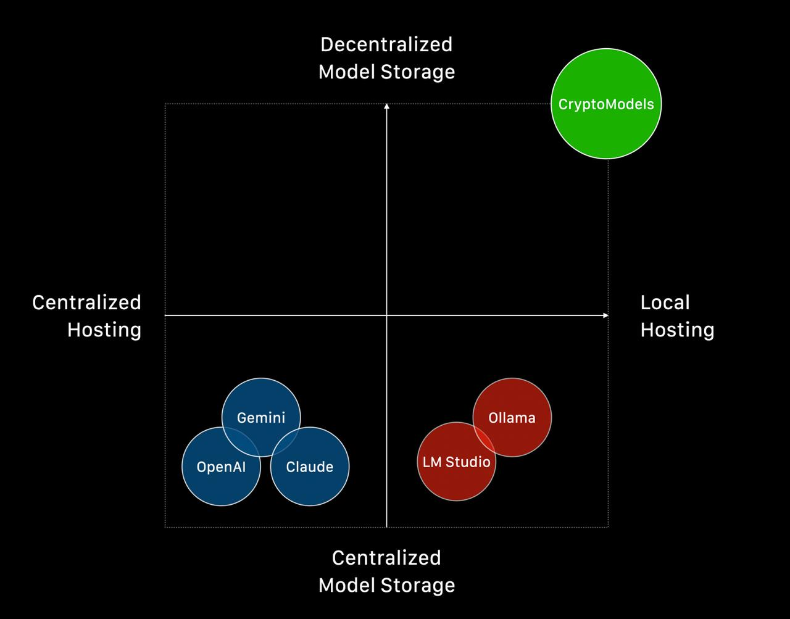
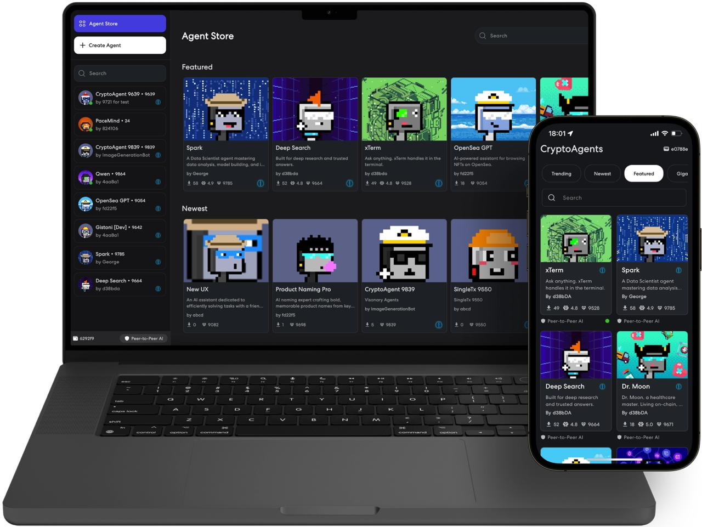

# 🚀 CryptoModels: Sovereign Weights


## The Easiest Way to Run Your Own AI Models with Complete Sovereignty


This guide will help you deploy your AI models using decentralized infrastructure. Whether you're a developer or AI enthusiast, you'll learn how to run your models with complete sovereignty - maintaining full control over your AI weights through decentralized storage.

## 📑 Table of Contents
- [Key Features](#-key-features)
- [Before You Start](#-before-you-start)
- [Getting Started](#️-getting-started)
- [CLI Overview](#-cli-overview)
- [Running Models](#-running-models)
- [Using the API](#-using-the-api)
- [Multi-Model Support](#-multi-model-support)
- [Advanced Usage](#advanced-usage)
- [Additional Information](#-additional-information)
- [Migration Guide](#-migration-guide)
- [Need Help?](#-need-help)

## 🌟 Key Features

### 🚀 What Makes CryptoModels Different from Ollama & LMStudio

**🌐 TRUE Decentralized Model Storage**
- Unlike Ollama/LMStudio that rely on centralized repositories (Hugging Face, GitHub), CryptoAgents uses **IPFS/Filecoin** for permanent, censorship-resistant model distribution
- Models are stored across a distributed network - **no single point of failure or control**
- Access your models even if traditional platforms go down or restrict access

**🔒 Ultimate Privacy with Local Execution**  
- **100% local inference** - your data never touches external servers (unlike cloud AI services)
- **Zero telemetry** - no usage tracking, no model access logs, no data collection
- **Air-gapped capability** - run models completely offline once downloaded

### 🛠️ Additional Capabilities

- **🏛️ Sovereign Weights**: Maintain complete ownership and control over your AI models
- **🛡️ Zero Trust Privacy**: Your prompts, responses, and model usage remain completely private
- **🔗 OpenAI Compatibility**: Use familiar API endpoints with your existing tools
- **👁️ Multi-Model Support**: Works with both text and vision models
- **⚡ Parallel Processing**: Efficient model compression and upload
- **🔄 Automatic Retries**: Robust error handling for network issues
- **📊 Metadata Management**: Comprehensive model information tracking

### Why Sovereign Weights Matter

In an era of increasing AI centralization, CryptoModels puts you back in control:

- **Own Your Models**: Models are stored on decentralized infrastructure, not controlled by any single entity
- **Private by Design**: All inference happens locally on your hardware - no external API calls, no data collection
- **Censorship Resistant**: Decentralized storage ensures your models remain accessible regardless of platform policies
- **Vendor Independence**: Break free from proprietary AI services and their limitations

##  Before You Start

### System Requirements
- macOS or Linux operating system
- Sufficient RAM for your chosen model (see model specifications below)
- Stable internet connection for model uploads

## 🛠️ Getting Started

### Installation

#### For macOS (Using Setup Script):
```bash
bash mac.sh
```
> **Note**: You'll need `llama.cpp.rb` in the same directory as `mac.sh`

#### For Ubuntu (Using Setup Script):
```bash
bash ubuntu.sh
```
#### For Jetson (Using Setup Script):
```bash
bash jetson.sh
```

### Setting Up Your Environment

1. Activate the virtual environment:
```bash
source cryptomodels/bin/activate
```
> **Remember**: Activate this environment each time you use the CryptoModels (`eai`) tools

2. Verify your installation:
```bash
eai --version
```

## 📖 CLI Overview

CryptoModels uses a structured command hierarchy for better organization. All model operations are grouped under the `model` subcommand:

```bash
# Model operations
eai model run --hash <hash>           # Run a model server
eai model run <model-name>            # Run a preserved model (e.g., qwen3-1.7b)
eai model serve [--main-hash <hash>]  # Serve all downloaded models (with optional main model)
eai model stop                        # Stop the running model server  
eai model status                      # Check which model is running
eai model download --hash <hash>      # Download a model from IPFS
eai model preserve --folder-path <path>  # Upload/preserve a model to IPFS

# General commands
eai --version                         # Show version information
```

### Command Examples

```bash
# Run a preserved model (user-friendly)
eai model run qwen3-1.7b --port 8080

# Run any model by hash
eai model run --hash bafkreiacd5mwy4a5wkdmvxsk42nsupes5uf4q3dm52k36mvbhgdrez422y --port 8080

# Serve all downloaded models (random main model)
eai model serve --port 8080

# Serve all downloaded models with specific main model
eai model serve --main-hash bafkreiacd5mwy4a5wkdmvxsk42nsupes5uf4q3dm52k36mvbhgdrez422y --port 8080

# Check status
eai model status

# Stop the running model
eai model stop

# Download a model locally
eai model download --hash bafkreiacd5mwy4a5wkdmvxsk42nsupes5uf4q3dm52k36mvbhgdrez422y

# Upload your own model
eai model preserve --folder-path ./my-model-folder --task chat --ram 8.5
```

## 🚀 Running Models

### Available Pre-uploaded Models

We've prepared several models for you to test with. Each model is listed with its specifications and command to run.

#### 🔤 Qwen3 Series
[Learn more about Qwen3](https://qwenlm.github.io/blog/qwen3/)

| Model | Size | RAM | Command |
|-------|------|-----|---------|
| qwen3-embedding-0.6b | 649 MB | 1.16 GB | `eai model run qwen3-embedding-0.6b` |
| qwen3-embedding-4b | 4.28 GB | 5.13 GB | `eai model run qwen3-embedding-4b` |
| qwen3-1.7b | 1.83 GB | 5.71 GB | `eai model run qwen3-1.7b` |
| qwen3-4b | 4.28 GB | 9.5 GB | `eai model run qwen3-4b` |
| qwen3-8b | 6.21 GB | 12 GB | `eai model run qwen3-8b` |
| qwen3-14b | 15.7 GB | 19.5 GB | `eai model run qwen3-14b` |
| qwen3-30b-a3b | 31 GB | 37.35 GB | `eai model run qwen3-30b-a3b` |
| qwen3-32b | 34.8 GB | 45.3 GB | `eai model run qwen3-32b` |

#### 👁️ Gemma-3 Series (Vision Support)
[Learn more about Gemma3](https://deepmind.google/models/gemma/gemma-3/)

| Model | Size | RAM | Command |
|-------|------|-----|---------|
| gemma-3-4b | 3.16 GB | 7.9 GB | `eai model run gemma-3-4b` |
| gemma-3-12b | 8.07 GB | 21.46 GB | `eai model run gemma-3-12b` |
| gemma-3-27b | 17.2 GB | 38.0 GB | `eai model run gemma-3-27b` |

#### 🔤 Gemma-3n Series 
[Learn more about Gemma-3n](https://deepmind.google/models/gemma/gemma-3n/)

| Model | Size | RAM | Command |
|-------|------|-----|---------|
| gemma-3n-e4b | 7.35 GB | 10.08 GB | `eai model run gemma-3n-e4b` |

#### 🔤 Devstral-Small
[Learn more about Devstral-Small](https://mistral.ai/news/devstral)

| Model | Size | RAM | Command |
|-------|------|-----|---------|
| devstral-small | 25.1 GB | 31.71 GB | `eai model run devstral-small` |

#### 🎨 Flux Series
[Learn more about Flux](https://bfl.ai/models/flux-kontext)

Generate high-quality images from text prompts using Flux models.

| Model | Size | RAM | Command |
|-------|------|-----|---------|
| flux-dev | 32 GB | 20 GB | `eai model run flux-dev` |
| flux-schnell | 32 GB | 20 GB | `eai model run flux-schnell` |

**Example usage:**
```bash
eai model run flux-dev
```

## 💻 Using the API

The API follows the OpenAI-compatible format, making it easy to integrate with existing applications.

### Prefer a GUI?
If you would rather interact with your models through a user-friendly desktop interface, download the **CryptoAgents** app from our Agent Store: [eternalai.org/agent-store](https://eternalai.org/agent-store).



### Text Chat Example
```bash
curl -X POST http://localhost:8080/v1/chat/completions \
  -H "Content-Type: application/json" \
  -d '{
    "model": "local-model",
    "messages": [
        {"role": "user", "content": "Hello! Can you help me write a Python function?"}
    ],
    "temperature": 0.7,
    "max_tokens": 4096
}'
```

### Vision Chat Example (Gemma models only)
```bash
curl -X POST http://localhost:8080/v1/chat/completions \
  -H "Content-Type: application/json" \
  -d '{
    "model": "local-model",
    "messages": [
       {
        "role": "user",
        "content": [
            {
                "type": "text",
                "text": "What do you see in this image? Please describe it in detail."
            },
            {
                "type": "image_url",
                "image_url": {
                    "url": "https://example.com/your-image.jpg"
                }
            }
        ]
       }
    ],
    "temperature": 0.7,
    "max_tokens": 4096
}'
```

### Embedding Example

```bash
curl -X POST http://localhost:8080/v1/embeddings \
  -H "Content-Type: application/json" \
  -d '{
    "model": "local-model",
    "input": ["Hello, world!"]
}'
```

### Image Generation Example (Flux models)

```bash
curl -X POST http://localhost:8080/v1/images/generations \
  -H "Content-Type: application/json" \
  -d '{
    "model": "local-model",
    "prompt": "A serene landscape with mountains and a lake at sunset",
    "n": 1,
    "size": "1024x1024"
}'
```

## 🔄 Multi-Model Support

CryptoModels supports running multiple models simultaneously with intelligent request-based switching. This allows you to serve several models from a single server instance with optimized resource usage.

### How Multi-Model Works

#### **Setup Types:**

1. **Single Model**: Traditional approach - one model loaded and active
2. **Multi-Model**: Multiple models available, with automatic switching based on requests

#### **Model States:**
- **Main Model**: The primary model that's immediately loaded and active when the server starts
- **On-Demand Models**: Additional models that are loaded automatically when first requested

### **Request-Based Model Switching**

When a client makes a request specifying a model (via the `model` field in the API), the system:

1. **Checks Current Model**: If the requested model is already active → processes immediately
2. **Smart Switching**: If a different model is requested → automatically switches to that model
3. **Stream Protection**: Waits for active streams to complete before switching models
4. **Automatic Loading**: On-demand models are loaded seamlessly when first requested

#### **Switching Logic Flow:**
```
Incoming Request
    ↓
Check Model Field
    ↓
Model Field Present?
    ├─ NO → Use Main Model (immediate)
    └─ YES → Is Requested Model Valid?
        ├─ NO → Use Main Model (fallback)
        └─ YES → Is Requested Model Active?
            ├─ YES → Process Request Immediately
            └─ NO → Check for Active Streams
                ├─ Streams Active → Wait for Completion
                └─ No Streams → Switch Model → Process Request
```

### **Running Multi-Model Setups**

#### **Method 1: Specify Multiple Models by Task**
```bash
# Mix different task types for comprehensive AI service
eai model run qwen3-8b,qwen3-embedding-4b,flux-dev
# Main: qwen3-8b (chat), On-demand: qwen3-embedding-4b (embed), flux-dev (image-generation)

# Chat-focused setup with multiple chat models
eai model run qwen3-1.7b,qwen3-8b,gemma-3-4b
# Main: qwen3-1.7b (chat), On-demand: qwen3-8b (chat), gemma-3-4b (chat with vision)

# Embedding-focused setup
eai model run qwen3-embedding-4b,qwen3-embedding-0.6b
# Main: qwen3-embedding-4b (embed), On-demand: qwen3-embedding-0.6b (embed)

# Run with custom hashes for any task type
eai model run --hash hash1,hash2,hash3
# Main: hash1, On-demand: hash2, hash3
```

#### **Method 2: Serve All Downloaded Models by Task**
```bash
# Auto-discover and serve all downloaded models (any mix of tasks)
eai model serve
# Randomly selects main model from available models of any task type

# Serve all with specific main model
eai model serve --main-hash <specific_hash>
# Uses specified hash as main (could be chat, embed, or image-generation)
```

#### **Task-Specific Server Examples**
```bash
# Multi-task AI server (recommended for versatility)
eai model run qwen3-8b,qwen3-embedding-4b,flux-dev
# Provides: chat completion, text embeddings, and image generation

# Vision-enabled chat server
eai model run gemma-3-4b,qwen3-8b
# Provides: vision chat (main) and text-only chat (on-demand)

# Embedding service with fallback
eai model run qwen3-embedding-4b,qwen3-embedding-0.6b
# Provides: high-quality embeddings (main) and fast embeddings (on-demand)

# Image generation studio
eai model run flux-dev,flux-schnell
# Provides: high-quality images (main) and fast images (on-demand)
```

### **API Usage with Multi-Model**

Once running, specify which model to use in your API requests:

#### **Discovering Available Models**

First, check what models are available using the `/v1/models` endpoint:

```bash
curl http://localhost:8080/v1/models
```

**Example Response:**
```json
{
  "data": [
    {
      "id": "bafkreid5z4lddvv4qbgdlz2nqo6eumxwetwmkpesrumisx72k3ahq73zpy",
      "root": "qwen3-8b", 
      "ram": 12.0,
      "folder_name": "qwen3-8b",
      "task": "chat"
    },
    {
      "id": "bafkreiaevddz5ssjnbkmdrl6dzw5sugwirzi7wput7z2ttcwnvj2wiiw5q",
      "root": "qwen3-embedding-4b",
      "ram": 5.13, 
      "folder_name": "qwen3-embedding-4b",
      "task": "embed"
    },
    {
      "id": "bafkreiaha3sjfmv4affmi5kbu6bnayenf2avwafp3cthhar3latmfi632u",
      "root": "flux-dev",
      "ram": 20.0,
      "folder_name": "flux-dev", 
      "task": "image-generation"
    },
    {
      "id": "bafkreicr66zguzdldiqal4jdyrcd6y26lfaiy4glkah7n3hdve2ailptue",
      "root": "devstral-small",
      "ram": 31.71,
      "folder_name": "devstral-small",
      "task": "chat"
    }
  ]
}
```

#### **Using the Model Field in Requests**

Use the `id` (hash) from `/v1/models` as the `model` field in your requests:

##### **Chat Models (task: "chat")**

```bash
# Request using main chat model (immediate response)
curl -X POST http://localhost:8080/v1/chat/completions \
  -H "Content-Type: application/json" \
  -d '{
    "model": "bafkreib6pws5dx5ur6exbhulmf35twfcizdkxvup4cklzprlvaervfz5zy",
    "messages": [{"role": "user", "content": "Hello!"}]
}'

# Switch to a different chat model (may have brief delay on first use)
curl -X POST http://localhost:8080/v1/chat/completions \
  -H "Content-Type: application/json" \
  -d '{
    "model": "bafkreid5z4lddvv4qbgdlz2nqo6eumxwetwmkpesrumisx72k3ahq73zpy",
    "messages": [{"role": "user", "content": "Complex reasoning task"}]
}'
```

##### **Embedding Models (task: "embed")**

```bash
# Use embedding model for text similarity
curl -X POST http://localhost:8080/v1/embeddings \
  -H "Content-Type: application/json" \
  -d '{
    "model": "bafkreiacd5mwy4a5wkdmvxsk42nsupes5uf4q3dm52k36mvbhgdrez422y",
    "input": ["Hello, world!", "How are you?"]
}'

# Switch to a larger embedding model
curl -X POST http://localhost:8080/v1/embeddings \
  -H "Content-Type: application/json" \
  -d '{
    "model": "bafkreia7nzedkxlr6tebfxvo552zq7cba6sncloxwyivfl3tpj7hl5dz5u",
    "input": ["Complex document text for better embeddings"]
}'
```

##### **Image Generation Models (task: "image-generation")**

```bash
# Generate images using Flux model
curl -X POST http://localhost:8080/v1/images/generations \
  -H "Content-Type: application/json" \
  -d '{
    "model": "bafkreiaha3sjfmv4affmi5kbu6bnayenf2avwafp3cthhar3latmfi632u",
    "prompt": "A serene landscape with mountains and a lake at sunset",
    "n": 1,
    "steps": 25,
    "size": "1024x1024"
}'

# Switch to different image generation model
curl -X POST http://localhost:8080/v1/images/generations \
  -H "Content-Type: application/json" \
  -d '{
    "model": "bafkreibks5pmc777snbo7dwk26sympe2o24tpqfedjq6gmgghwwu7iio34",
    "prompt": "A futuristic city skyline at night",
    "n": 1,
    "size": "1024x1024"
}'
```

##### **Vision Models (task: "chat" with image support)**

```bash
# Use vision-capable chat model
curl -X POST http://localhost:8080/v1/chat/completions \
  -H "Content-Type: application/json" \
  -d '{
    "model": "bafkreiaevddz5ssjnbkmdrl6dzw5sugwirzi7wput7z2ttcwnvj2wiiw5q",
    "messages": [{
      "role": "user",
      "content": [
        {"type": "text", "text": "What do you see in this image?"},
        {"type": "image_url", "image_url": {"url": "https://example.com/image.jpg"}}
      ]
    }]
}'
```

#### **Model Switching Behavior**

**Important**: The server uses the following logic for model selection:

1. **Explicit Model Request**: When you specify `"model": "<model_hash>"` → switches to that model
2. **No Model Field**: When you omit the `"model"` field → uses the main model  
3. **Invalid Model**: When you specify a non-existent model → falls back to main model

```bash
# ✅ Correct: Switch to specific model using hash
curl -X POST http://localhost:8080/v1/chat/completions \
  -H "Content-Type: application/json" \
  -d '{
    "model": "bafkreib6pws5dx5ur6exbhulmf35twfcizdkxvup4cklzprlvaervfz5zy",
    "messages": [{"role": "user", "content": "Use specific model hash"}]
}'

# ⚠️ Fallback: No model specified → uses main model
curl -X POST http://localhost:8080/v1/chat/completions \
  -H "Content-Type: application/json" \
  -d '{
    "messages": [{"role": "user", "content": "Uses main model"}]
}'

# ⚠️ Fallback: Invalid model hash → uses main model
curl -X POST http://localhost:8080/v1/chat/completions \
  -H "Content-Type: application/json" \
  -d '{
    "model": "invalid-hash-12345",
    "messages": [{"role": "user", "content": "Falls back to main model"}]
}'
```

**Key Points:**
- **Model Hash Required**: To switch models, always use valid hash identifiers (the `id` field) from `/v1/models`
- **Folder Names Don't Work**: Using folder names like `"qwen3-8b"` in the model field will cause fallback to main model
- **Graceful Fallback**: Invalid or missing model specifications default to the main model
- **No Errors**: The server won't throw errors for invalid models, it silently uses the main model
- **Performance**: Main model requests are always fastest (no switching delay)

#### **Model Identifier Options**

You can use the following as the `model` field:
- **Hash (Required for Switching)**: `"bafkreib6pws5dx5ur6exbhulmf35twfcizdkxvup4cklzprlvaervfz5zy"` (from `id` field in `/v1/models`)
- **Generic Fallback**: `"local-model"` (uses currently active model - not recommended)

**Important**: Only model hashes work for switching between models. Folder names or other identifiers will cause the server to fall back to the main model.

#### **Task-Based Model Selection**

When running multi-model setups, you can serve different models for different tasks:

```bash
# Example: Serve chat, embedding, and image generation models together
eai model run qwen3-8b,qwen3-embedding-4b,flux-dev

# Then use different endpoints with appropriate model hashes:
# - Chat: /v1/chat/completions with hash of qwen3-8b
# - Embeddings: /v1/embeddings with hash of qwen3-embedding-4b  
# - Images: /v1/images/generations with hash of flux-dev
```

#### **Recommended Workflow for Model Requests**

```bash
# 1. Start your multi-model server
eai model run qwen3-8b,qwen3-embedding-4b,flux-dev

# 2. Discover available models and their hash IDs
curl http://localhost:8080/v1/models

# 3. Make requests with explicit model hash specification (use "id" field from step 2)
curl -X POST http://localhost:8080/v1/embeddings \
  -H "Content-Type: application/json" \
  -d '{
    "model": "bafkreia7nzedkxlr6tebfxvo552zq7cba6sncloxwyivfl3tpj7hl5dz5u",
    "input": ["Text to embed"]
}'
```

**Warning**: If you omit the `"model"` field or use an invalid model hash, the server will silently fall back to the main model (first model in the startup list), which may not be appropriate for your task type.

### **Performance Considerations**

#### **✅ Optimizations:**
- **Smart Caching**: Models stay loaded once activated
- **Stream Protection**: No interruptions during active conversations
- **Resource Sharing**: Efficient memory usage across models
- **Fast Switching**: Sub-second model switching when no streams are active

#### **📊 Behavior:**
- **First Request**: On-demand models have a brief loading delay (2-10 seconds)
- **Subsequent Requests**: Instant response from cached models
- **Memory Usage**: Only active models consume GPU/RAM resources
- **Concurrent Streams**: Multiple simultaneous conversations supported
- **Fallback Performance**: Missing/invalid model requests use main model (no switching delay)
- **Silent Fallback**: No error messages for invalid models, seamless fallback to main model

#### **⚡ Best Practices:**
- **Start with Main Model**: Choose your most frequently used model as main
- **Group by Task**: Use similar-sized models for consistent performance
- **Monitor Resources**: Ensure sufficient RAM for your model combination
- **Validate Model Names**: Always check `/v1/models` before making requests to ensure model exists
- **Explicit Model Specification**: Always include the `"model"` field to avoid unexpected fallback
- **Client-Side Validation**: Implement model validation in your application to prevent silent fallbacks
- **Task-Specific Optimization**:
  - **Chat Models**: Prioritize context length and response quality
  - **Embedding Models**: Consider batch processing capabilities
  - **Image Generation**: Ensure adequate GPU memory for high-resolution outputs
  - **Vision Models**: Account for image processing overhead
- **Mixed-Task Servers**: When serving multiple task types, start with the most resource-intensive model as main
- **Model Switching**: Keep similar task types together for faster switching

### **Model Management**

#### **CLI Status Monitoring:**
```bash
# Check current server status and active model
eai model status

# Shows current active model and total loaded models
```

#### **API Model Discovery:**
```bash
# List all available models with detailed information
curl http://localhost:8080/v1/models

# Returns model IDs, names, RAM requirements, task types, and status
```

**Key Information Returned:**
- **`id`**: Model hash (unique identifier)
- **`root`**: Folder name (user-friendly name)
- **`ram`**: Memory requirement in GB
- **`folder_name`**: Original folder name
- **`task`**: Model type and compatible endpoints:
  - **`"chat"`**: Use with `/v1/chat/completions` (includes vision models)
  - **`"embed"`**: Use with `/v1/embeddings`
  - **`"image-generation"`**: Use with `/v1/images/generations`

Use the `id` (hash) value as the `model` field in your API requests to specify which model to use. Note that using `root` (folder name) values will cause fallback to the main model. Match the model's `task` type with the appropriate API endpoint for optimal results.

## Advanced Usage

### Prerequisites for Model Preservation
1. A model in `gguf` format (compatible with `llama.cpp`)
2. A [Lighthouse](https://lighthouse.storage/) account and API key

### Uploading Custom Models

You can use `eai model preserve` to upload your own `gguf` models downloaded from [Huggingface](https://huggingface.co/) for deploying to the CryptoAgents platform.

#### Model Preparation

The platform now supports multiple model types through the `--task` parameter:

##### For Chat Models (Text Generation)

Use `--task chat` for conversational AI and text generation models.

1. **Download the model**:
   - Go to Huggingface and download your desired `.gguf` model
   - Example: Download [`Qwen3-8B-Q8_0.gguf`](https://huggingface.co/Qwen/Qwen3-8B-GGUF/blob/main/Qwen3-8B-Q8_0.gguf)

2. **Prepare the folder structure**:
   - Create a new folder with a descriptive name (e.g., `qwen3-8b-q8`)
   - Place the downloaded `.gguf` file inside this folder
   - Rename the file to match the folder name, but **remove the `.gguf` extension**

**Example Structure for Chat Models:**
```
qwen3-8b-q8/              # Folder name
└── qwen3-8b-q8          # File name (no .gguf extension)
```

##### For Embedding Models

Use `--task embed` for text embedding and similarity models.

1. **Download the embedding model**:
   - Go to Huggingface and download your desired embedding model in `.gguf` format
   - Example: Text embedding models like [`Qwen3 Embedding 0.6B`](https://huggingface.co/Qwen/Qwen3-Embedding-0.6B-GGUF) or specialized embedding models

2. **Prepare the folder structure**:
   - Create a new folder with a descriptive name (e.g., `qwen3-embedding-0.6b-q8`)
   - Place the downloaded `.gguf` file inside this folder
   - Rename the file to match the folder name, but **remove the `.gguf` extension**

**Example Structure for Embedding Models:**
```
qwen3-embedding-0.6b-q8/         # Folder name
└── qwen3-embedding-0.6b-q8     # File name (no .gguf extension)
```

##### For Vision Models (Image-Text-to-Text)

Use `--task chat` for vision models as they are conversational models with image understanding capabilities.

1. **Download the model files**:
   - Go to Huggingface and download both required files:
     - The main model file (e.g., [`gemma-3-4b-it-q4_0.gguf`](https://huggingface.co/google/gemma-3-4b-it-qat-q4_0-gguf/blob/main/gemma-3-4b-it-q4_0.gguf))
     - The projector file (e.g., [`mmproj-model-f16-4B.gguf`](https://huggingface.co/google/gemma-3-4b-it-qat-q4_0-gguf/blob/main/mmproj-model-f16-4B.gguf))

2. **Prepare the folder structure**:
   - Create a new folder with a descriptive name (e.g., `gemma-3-4b-it-q4`)
   - Place both downloaded files inside this folder
   - Rename the files to match the folder name, but **remove the `.gguf` extension**
   - Add `-projector` suffix to the projector file

**Example Structure for Vision Models:**
```
gemma-3-4b-it-q4/                    # Folder name
├── gemma-3-4b-it-q4                # Main model file (no .gguf extension)
└── gemma-3-4b-it-q4-projector      # Projector file (no .gguf extension)
```

#### Estimating RAM Requirements

Use the [GGUF parser](https://www.npmjs.com/package/@huggingface/gguf) to estimate RAM usage:

```bash
npx @huggingface/gguf qwen3-8b-q8/qwen3-8b-q8 --context 32768
```

#### Upload Commands

**Basic Upload:**
```bash
export LIGHTHOUSE_API_KEY=your_api_key
eai model preserve --folder-path qwen3-8b-q8
```

**Advanced Upload with Metadata:**
```bash
export LIGHTHOUSE_API_KEY=your_api_key
eai model preserve \
  --folder-path qwen3-8b-q8 \
  --task chat \
  --ram 12 \
  --hf-repo Qwen/Qwen3-8B-GGUF \
  --hf-file Qwen3-8B-Q8_0.gguf \
  --zip-chunk-size 512 \
  --threads 16 \
  --max-retries 5
```

**Upload for Embedding Models:**
```bash
export LIGHTHOUSE_API_KEY=your_api_key
eai model preserve \
  --folder-path qwen3-embedding-0.6b-q8 \
  --task embed \
  --ram 1.16 \
  --hf-repo Qwen/Qwen3-Embedding-0.6B-GGUF \
  --hf-file Qwen3-Embedding-0.6B-Q8_0.gguf
```

#### Upload Options

| Option | Description | Default | Required |
|--------|-------------|---------|----------|
| `--folder-path` | Folder containing the model files | - | ✅ |
| `--task` | Task type: `chat` for text generation models, `embed` for embedding models | `chat` | ❌ |
| `--ram` | RAM usage in GB at 32768 context length | - | ❌ |
| `--hf-repo` | Hugging Face repository (e.g., `Qwen/Qwen3-8B-GGUF`) | - | ❌ |
| `--hf-file` | Original Hugging Face filename | - | ❌ |
| `--zip-chunk-size` | Compression chunk size in MB | 512 | ❌ |
| `--threads` | Number of compression threads | 16 | ❌ |
| `--max-retries` | Maximum upload retry attempts | 5 | ❌ |

#### Upload Process

The upload process involves several steps:

1. **Compression**: The model folder is compressed using `tar` and `pigz` for optimal compression
2. **Chunking**: Large files are split into chunks (default: 512MB) for reliable uploads
3. **Parallel Upload**: Multiple chunks are uploaded simultaneously for faster transfer
4. **Retry Logic**: Failed uploads are automatically retried up to 20 times
5. **Metadata Generation**: A metadata file is created with upload information and model details
6. **IPFS Storage**: All files are stored on IPFS via Lighthouse.storage

#### Troubleshooting

**Common Issues:**
- **Missing API Key**: Ensure `LIGHTHOUSE_API_KEY` is set in your environment
- **Network Issues**: The system will automatically retry failed uploads
- **Insufficient RAM**: Check the model's RAM requirements before uploading
- **Invalid File Format**: Ensure the model is in GGUF format

## 📚 Additional Information

### Model Format
- We support GGUF files compatible with llama.cpp
- Convert other formats using [llama.cpp conversion tools](https://github.com/ggerganov/llama.cpp)

### Performance Tips
- Choose quantization levels (Q4, Q6, Q8) based on your hardware capabilities
- Higher quantization (Q8) offers better quality but requires more resources
- Lower quantization (Q4) is more efficient but may affect model performance
- Monitor system resources during model operation
- Use appropriate context lengths for your use case

### Security
- All models are stored on IPFS with content addressing
- This ensures model integrity and secure distribution
- API keys are stored securely in environment variables
- Models are verified before deployment

### Best Practices
1. **Model Selection**
   - Choose models based on your hardware capabilities
   - Consider quantization levels for optimal performance
   - Test models locally before deployment

2. **Resource Management**
   - Monitor RAM usage during model operation
   - Adjust context length based on available memory
   - Use appropriate batch sizes for your use case

3. **API Usage**
   - Implement proper error handling
   - Use appropriate timeouts for requests
   - Cache responses when possible
   - Monitor API usage and performance

4. **Deployment**
   - Test models thoroughly before production use
   - Keep track of model versions and CIDs
   - Document model configurations and requirements
   - Regular backups of model metadata

## 🆘 Need Help?

- Visit our website: [eternalai.org](https://eternalai.org)
- Join our community: [Discord](https://discord.gg/YphRKtSFqS)
- Check our documentation for detailed guides and tutorials
- Report issues on our GitHub repository
- Contact support for enterprise assistance
